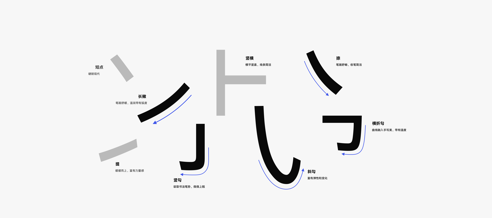
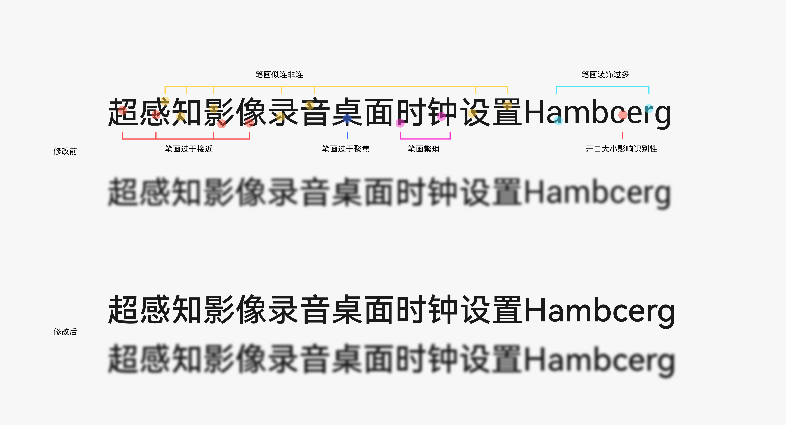

## 鸿蒙字体(HarmonyOS Sans)
作者：[华为软件技术有限公司](https://developer.huawei.com)
使用协议：[其他](./LICENSE)
### 特点
- **多语言支持**：涵盖简体中文、繁体中文、英文等多种语言。
- **多字重**：6字重
- **高可读性**：试用于网页及UI设计
### 详细介绍
通过研究用户在不同场景下对多终端设备的阅读反馈，综合考量不同设备的尺寸、使用场景等因素，同时也考虑用户使用设备时因视距、视角的差异带来的字体大小和字重的不同诉求，我们为 HarmonyOS 设计了全新系统默认的字体——HarmonyOS Sans。

[官网下载 HarmonyOS Sans](https://communityfile-drcn.op.dbankcloud.cn/FileServer/getFile/cmtyPub/011/111/111/0000000000011111111.20240410094515.88271174201436676532153439068027:50001231000000:2800:867A24FFF367A21762C3F4E121FC473F3CCA7203031BA27AB9AE7A73A5AAAB11.zip?needInitFileName=true)

全新字体笔画设计
在保障字体体验的功能性前提下，我们在人文和现代中找到新的平衡。在短笔画时保持横平竖直，简约无装饰，撇捺弯钩长笔画中融入书法的笔势美学，带来全新的视觉感受。

优化字体灰度，提升阅读体验
在不同设备的应用场景下，字体的灰度会影响在弱光环境、小字号、远距离下的识别性。因此我们优化字体的灰度，让新字体在不同场景下具有更好的识别性和阅读体验。

#### 统一多语言字形风格
我们重新设计了中文、拉丁文、希利尔文、希腊文、阿拉伯文的字形样式，支持100+语言，让多语言下阅读体验更加一致。

#### HarmonyOS 字体特性
动态字重粗细调节
HarmonyOS Sans支持可变特性，让用户选择他们喜欢的字体粗细来进行文本的显示。